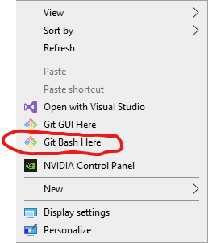
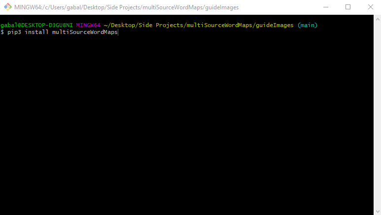

# Pre-Requisites
* [Git Bash](https://www.stanleyulili.com/git/how-to-install-git-bash-on-windows/)  **(Windows Only)**
  * Git bash will install a terminal with a linux flavor. This is the only terminal I could get to work with entry-points for python.
* [Python3](https://programmingwithjim.wordpress.com/2020/09/08/installing-python-3-in-git-bash-on-windows-10/)
  * Downloading python will give you a package manager which you will use to download the package

# Installing MultiSource Word Maps
* Right click on your desktop and open git bash 

 
 
 
 
 
 

* Run `pip3 install multiSourceWordMaps`. This will install the package on to your computer and give you access to the `map`.

 
 
 
 
 
 
 
 
 
 
 
 
 
 

# Using the package
## Map from single source
If you would like to quickly make a single map from a source then you can use the following command `map make SQ --source https://square.com/investors`:
* `map` This is the command to start the program.
* `make` This sub-command selects the mapMaker to act upon.
* `SQ` Lets the mapMaker know what ticker to look at to make all of the maps.
* `https://square.com/investors` Source that will be used to make the map.

## Multiple Maps at once
### Adding to Config
In order to make multiple maps at once you must first let the program know the sources you wish to use. These sources are organized under stock tickers. For example if you would like to make a map for a shareholder letter ( located on your desktop) for the company square, you would use the add command like so: `map config add SQ shareHolderLetter --location "C:\Users\gabal\Desktop\shareHolderletter.pdf"`. A breakdown of this command would be:

* `map` This is the command to start the program.
* `config` This sub-command selects the config to act upon.
* `add` This lets the program know you want to add to the config.
* `SQ` This is your ticker. Can be any ticker you want.
* `shareHolderLetter` This is what you want your source to be named. This naming will decide what your map will be named as well.
* `--location` When choosing pdf's as your location source you will need to specify where they are located on your computer. 
* `Path\to\pdf` Tells the program where the absoulte path is to your file.
  * If you're interested in learning more about all the options look at the api documentation below or run `map -h` for all your options.

You can also add websites by using the full url in place of `shareHolderLetter`. A full command to add a website to the config would look like this `map config add SQ https://square.com/investorSite`

### Making the Maps
Once you have added all the sources you want to your config file you can start making wordMaps. In order to do this for an entire ticker you would run the command `map make SQ`. A breakdown of this would be:

* `map` This is the command to start the program.
* `make` This sub-command selects the mapMaker to act upon.
* `SQ` Lets the mapMaker know what ticker to look at to make all of the maps

# Where are my maps?
The documents for this program will be located in different places based on what OS you are using. Here is the table:

| System  | Location                         | Example                    |
|---------|----------------------------------|----------------------------|
| Windows | C:/Users/{CurrentUser}/Documents | C:/Users/JohnDoe/Documents |
| Linux   | home/{CurrentUser}/Documents     | home/JohnDoe/Documents     |
| Mac     | home/{CurrentUser}/Documents     | home/JohnDoe/Documents     |

Each of these directories will contain a folder called `multiSourceWordMaps` with three subdirectories: PDFS, Text, Maps.
* `PDFs` Contains the pdfs you are using as sources.
* `Text` Intermediary files that the maps use as a text source.
* `Maps` Actual PNG images that are the word maps. 

# Accessing full documentation
For each command in this program you can append `-h` to see all information and options. A quick overview of the command will be listed below in a tree format. For details on each command use the -h command to get help.

# Future functionality
[ ] Adding command so you can combine multiple sources into a single file
[ ] Adding a filter subcommand that will give functionality in filtering words
